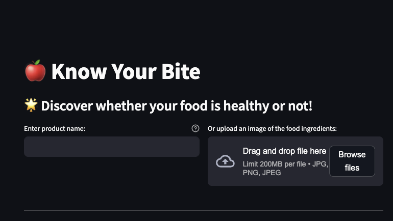
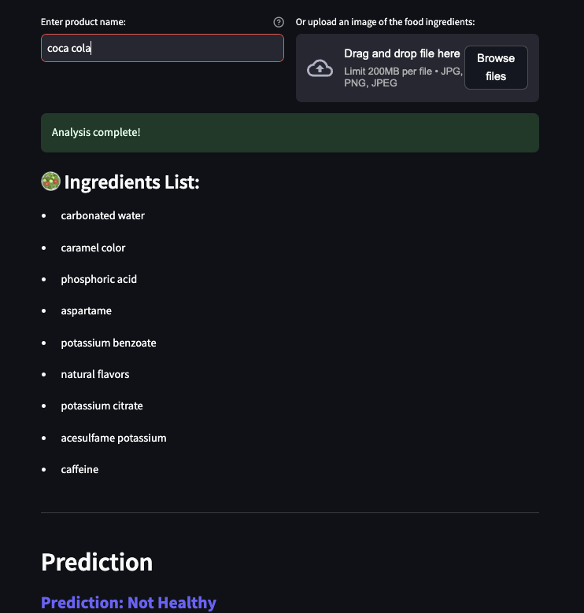
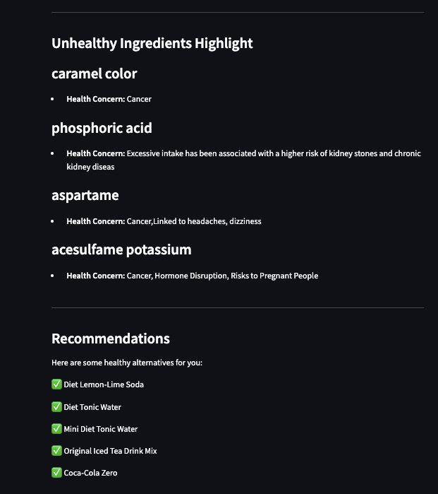
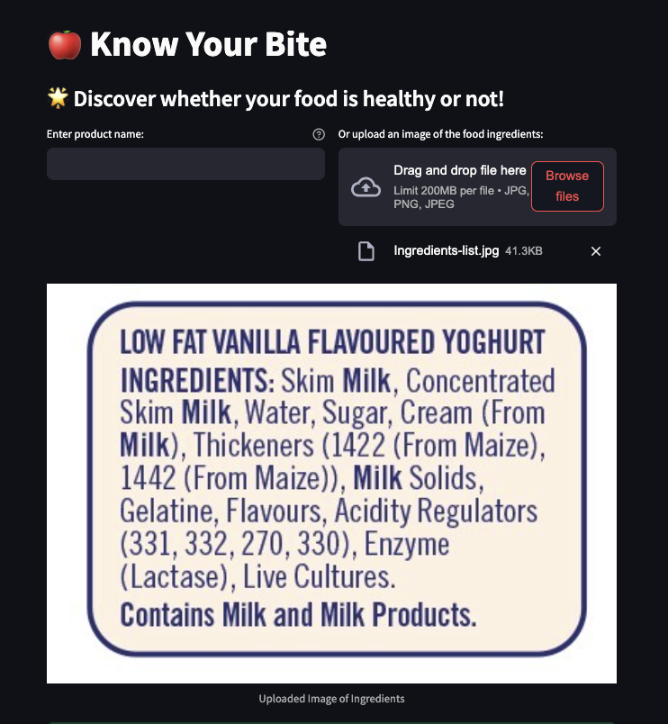
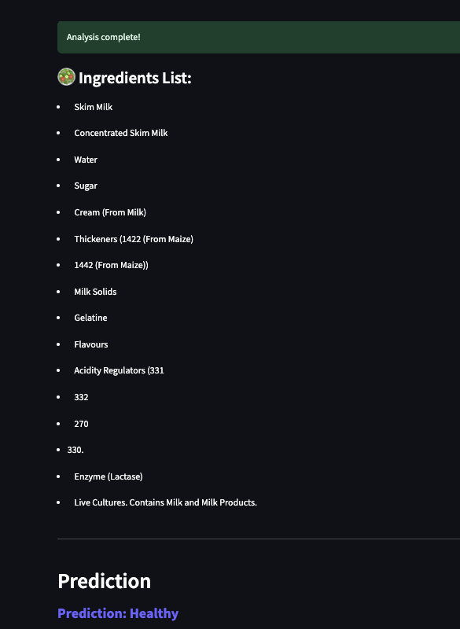

# **Know Your Bite: Smarter Food Choices**

## **Table of Contents**
1. [Problem Statement](#problem-statement)  
2. [Background](#background)  
3. [Data Collection](#data-collection)  
4. [Dataset Features](#dataset-features)  
5. [Model Performance and Evaluation](#model-performance-and-evaluation)  
6. [Recommender System](#recommender-system)  
7. [Key Takeaways](#key-takeaways)  
8. [Next Steps](#next-steps)  
9. [Installation and Setup Instructions](#installation-and-setup-instructions)  
10. [Usage Instructions](#usage-instructions)  
11. [Acknowledgments](#acknowledgments)  


---

## **Problem Statement**
"Know Your Bite" empowers consumers to make informed dietary choices by classifying food products based on ingredient lists and recommending healthier alternatives. This app leverages machine learning and extensive data to simplify food label complexity, improve transparency, and encourage healthier eating habits.
## **Background**

Food labeling and ingredient transparency are significant concerns for consumers striving to make informed dietary decisions. Complex ingredient lists, harmful additives, ambiguous terms, and alternative ingredient names make it challenging to assess health impacts. These challenges are further exacerbated by inconsistent labeling standards. While ingredient data is available, leveraging it effectively requires innovative solutions. Addressing these issues can empower consumers, promote healthier dietary habits, and enhance transparency.


## **Data Collection**
The data for this project was gathered from multiple sources:

1. **Harmful Ingredients Data:**  
   - Scraped from [CSPI (Center for Science in the Public Interest)](https://www.cspinet.org/page/chemical-cuisine-food-additive-safety-ratings).  

2. **Food Products Data:**  
   - Collected using the [Open Food Facts API](https://world.openfoodfacts.org/data).  

3. **Additional Research:**  
   - Alternate names for food additives and their European codes (E-codes) were researched online to ensure a comprehensive dataset.  

**Data Preparation Steps:**
- Standardized ingredient names to account for variations and aliases.
- Merged datasets from multiple sources to create a unified structure.
#### **Size (Samples & Features)**
- **Samples**: The dataset contains approximately 25457 samples.
- **Features**: There are 11 primary features in the dataset


[final_data.csv](./data/cleaned_data/final_data.csv): Contains data used for our model.
#### **Dataset Features**


| **Feature**             | **Type**   | **Dataset**         | **Description**                                                                 |
|--------------------------|------------|---------------------|---------------------------------------------------------------------------------|
| `brands`                | object     | final_data       | The brand names associated with the food products.                             |
| `product_name`          | object     | final_data       | The name of the food product.                                                  |
| `categories`            | object     | final_data       | The categories assigned to the food products.                                  |
| `countries`             | object     | final_data       | The countries where the food products are sold or distributed.                 |
| `food_groups_tags`      | object     | final_data       | Tags indicating the group classifications of the food products.                |
| `food_groups`           | object     | final_data       | The main food groups to which the products belong.                             |
| `ingredients_text`      | object     | final_data       | The full list of ingredients for each food product.                            |
| `category_name`         | object     | final_data       | The specific category name for each food product.                              |
| `country`               | object     | final_data       | The country associated with each food product entry.                           |
| `processed_ingredients` | object     | final_data       | The list of processed ingredients present in the food product.                 |
| `health_label`          | object     | final_data       | The assigned health label ("healthy" or "unhealthy") for each food product.  |


##  **Model Performance and Evaluation**
We tested several classification models to analyze and classify food products based on their ingredient lists. The goal was to determine whether a product is "healthy" or "unhealthy" and evaluate performance using metrics like accuracy, specificity, recall, and F1-scores.

#### **Models Evaluated**
1. Logistic Regression with Count Vectorizer.
2. Naive Bayes with TF-IDF Vectorizer and SMOTE.
3. Gradient Boosting with TF-IDF Vectorizer.


| **Model**                                   | **Training Accuracy** | **Test Accuracy** | **Specificity** | **Recall** | **F1-score Healthy** | **F1-score UnHealthy** |
|---------------------------------------------|-----------------------|-------------------|-----------------|------------|-----------------------|--------------------------|
| **Logistic Regression with Count Vectorizer** | 0.99                  | 0.98              | 0.99            | 0.92       | 0.99                  | 0.88                     |
| **Naive Bayes with TF-IDF Vectorizer** | 0.83                  | 0.83              | 0.82            | 0.93       | 0.90                  | 0.42                     |
| **Gradient Boosting with TF-IDF Vectorizer** | 1.00                  | 0.99              | 1.00            | 0.93       | 1.00                  | 0.95                     |

**Key Insights:**
- The **Gradient Boosting with TF-IDF Vectorizer** model performed best, with near-perfect accuracy and strong F1-scores for both classes.
- The **Naive Bayes** model struggled with "unhealthy" classifications, highlighting the need for further optimization.

## **Recommender System**
A cosine similarity-based recommender system was developed to suggest healthier alternatives for "unhealthy" food products. The system identifies similar products within the same food group by analyzing ingredient lists.

**Highlights:**
- Provides practical and consumer-friendly dietary swaps.
- Aligns recommendations with user preferences and food categories.


## **Key Takeaways**
1. **Classification Models:**
     - Gradient Boosting with TF-IDF Vectorizer delivered the best performance with 99% test accuracy and balanced F1-scores for both "healthy" and "unhealthy" classifications.
2. **Recommender System:**
    - The cosine similarity-based system provided relevant and practical healthier alternatives for "unhealthy" food products.
3. **Consumer Empowerment:**
    - This project bridges the gap between ingredient transparency and consumer decision-making, enabling healthier dietary choices.


## **Next Steps**
1. **Enhance Dataset:**  
   - Incorporate more global food products and additional nutritional details, such as calorie content or serving sizes.  

2. **Improve Recommender System:**  
   - Add advanced filtering options based on user dietary preferences (e.g., vegan, Halal, gluten-free).  
   - Integrate user feedback to personalize recommendations.

3. **Collaborate with Stakeholders:**  
   - Partner with food certification organizations to ensure reliable classifications for dietary preferences (e.g., Halal-certified, allergy-free products).  


## **Installation and Setup Instructions**


1. **Clone the repository:**
   ```bash
   git clone  https://git.generalassemb.ly/saima-ahmed/capstone.git
   cd know-your-bite


2. **Install dependencies:**
   ```bash
   pip install -r requirements.txt


3. **Run the Streamlit app:**
   ```bash
       streamlit run app.py


## **Usage Instructions**

1. Open the Streamlit app in your browser.
2. Enter a food product name or upload an image of its ingredient list.
3. View the product's classification as "healthy" or "unhealthy."
4. If classified as "unhealthy," receive recommendations for healthier alternatives within the same food group.
## **Streamlit App Interface**

Below are screenshots showcasing the functionality and design of the Streamlit app:

### **Home Page**
The app's home page allows users to input a product name or upload an image of its ingredient list for analysis.



### **Classification Output**
When a product name is entered, the app analyzes the ingredient list and displays whether the product is classified as "healthy" or "unhealthy."



### **Recommendations**
If a product is classified as "unhealthy," the app provides healthier alternatives within the same food group.



### **Image File Uploaded**
Users can upload an image of the product's ingredient list, and the app processes the file for analysis.



### **Ingredients Extracted**
Once the image is processed, the app extracts the ingredients and uses them to classify the product and suggest healthier alternatives.



## **Acknowledgments**

- Data sourced from [Open Food Facts API](https://world.openfoodfacts.org/data) and [CSPI (Center for Science in the Public Interest)](https://www.cspinet.org/page/chemical-cuisine-food-additive-safety-ratings).
- Developed with Streamlit, Python, and Scikit-learn.
- Thanks to all open-source contributors and documentation resources.